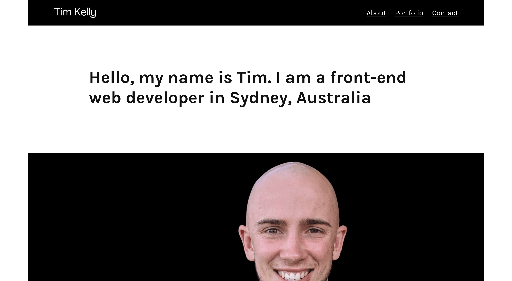

# Portfolio For Web Developer | timkelly.dev

This project is the source code for my portfolio website built with React - [timkelly.dev](https://timkelly.dev/).

[](https://timkelly.dev/)

## Getting started

Install dependencies

```bash
yarn install
```

Run website locally (http://localhost:3000)

```bash
yarn dev
```

## Technology

- [Next.js](https://nextjs.org/)
- [React](https://reactjs.org/)

## Project history

The portfolio was rebuilt using Next.js instead of `create-react-app` to learn a new framework. The core improvements include:

- Speed improvements: first contentful paint improved from 1.9s to 0.9s, and the speed index improved 2.1s to 1.1s
- User experience improvements: lazy loading images by default and set a blur placeholder for images.

You can view the legacy portfolio react app [here](https://github.com/timkellytk/portfolio-v1).

## Acknowledgments

- Inspired by the portfolio design of [dejan.works](http://dejan.works/) and the animations from [webflow.com](https://webflow.com/).

## License

This project is licensed under the MIT License - see the [LICENSE](LICENSE) file for details.
